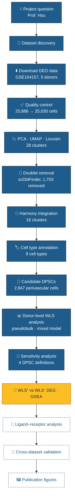
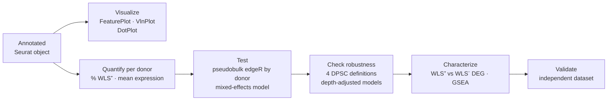

<div align="center">


<br>


<!-- After the Zenodo release, replace the line below with the DOI badge from your Zenodo record -->
<!-- [](https://doi.org/10.5281/zenodo.XXXXXXX) -->

**A systematic, reproducible single-cell analysis of *WLS* (Wntless / GPR177) expression in human dental pulp stem cells.**

[Key findings](#-key-findings) •
[Overview](#-overview) •
[Hypotheses](#-hypotheses) •
[Pipeline](#-pipeline) •
[Datasets](#️-datasets) •
[Results](#-results) •
[Figures](#️-figures) •
[Reports](#-reports) •
[Quick start](#-quick-start) •
[Roadmap](#️-roadmap) •
[Citation](#-citation)

</div>

---

## ⭐ Key findings

> [!IMPORTANT]
> **WLS is expressed in candidate human DPSCs in all five donors, but it is not enriched in them.**

| | Finding | Evidence |
|---|---|---|
| 1 | WLS is detected in candidate DPSCs in **every donor** | median 11.1% WLS⁺ cells per donor (range 1.3–16.8%) |
| 2 | WLS is **~1.9-fold lower** in candidate DPSCs than in pulp fibroblasts | pseudobulk edgeR, log2FC −0.95, FDR 0.0014 |
| 3 | The result is **robust to the DPSC definition** | never higher under 4 definitions; significantly lower under 3 |
| 4 | **Pulp fibroblasts** are the main WLS-expressing mesenchymal cells | highest WLS (20.7%) and highest WNT5A/WNT5B |
| 5 | Apparent WLS–WNT co-expression is a **sequencing-depth artefact** | depth-adjusted OR ≈ 1.0 in DPSCs and fibroblasts; only Schwann/glia remain significant |
| 6 | Donor differences in WLS detection **track sequencing depth** | Pulp3 has the lowest depth and lowest WLS detection |

Full details: [`docs/WLS_DPSC_Progress_Report_2.docx`](docs/WLS_DPSC_Progress_Report_2.docx).

## 🔬 Overview

**Dental pulp stem cells (DPSCs)** are multipotent mesenchymal cells in the dental pulp that support dentin repair, wound healing, and tissue homeostasis. **Wnt signaling** is a master regulator of stem cell self-renewal, differentiation, and regeneration, and **WLS (Wntless/GPR177)** is the transmembrane cargo receptor that every Wnt ligand needs in order to be secreted.

Despite several public human dental pulp single-cell datasets, nobody has systematically asked whether WLS is expressed in DPSCs, which pulp cells express it, or whether WLS-positive progenitors carry distinct stemness and Wnt programs. This project answers those questions by reanalyzing original public repositories and validating across independent datasets.

> [!NOTE]
> **Central question** (posed by Prof. Wei Hsu): *Is WLS expressed, and enriched, in human dental pulp stem cells?*

## 🧪 Hypotheses

| | Hypothesis | Primary test | Outcome (GSE164157) |
|---|---|---|---|
| **H1** | WLS is expressed in human DPSCs | Detection and % positive cells in candidate DPSCs | ✅ **Supported**: detected in all 5 donors |
| **H2** | WLS is significantly enriched in DPSCs versus non-DPSC pulp cells | Donor-level pseudobulk and mixed-effects models | ❌ **Not supported**: lower than fibroblasts, equal to pulp average |
| **H3** | WLS⁺ DPSCs show enhanced Wnt-associated pathway activity | DEG, GSEA, module scores, ligand–receptor inference | 🟡 **In progress**: WLS–WNT co-expression not supported after depth adjustment; WLS⁺ vs WLS⁻ DEG pending |

> [!TIP]
> Because WLS controls Wnt **secretion**, WLS⁺ cells are interpreted as Wnt-**producing**. H3 is tested on two axes: ligand-production programs (WNT genes, *PORCN*) and canonical response programs (*AXIN2*, *LEF1*, *TCF7*, *NKD1*, *NOTUM*, *LGR5*).

## 🧭 Pipeline



<sub>🟦 Completed  🟨 Next  ⬜ Planned</sub>

### Stage status

| Stage | Activity | Script | Status |
|---|---|---|---|
| 1 | Systematic dataset discovery | `01_dataset_discovery.R` | ✅ |
| 2 | Data acquisition | `02_download_GEO.R` | ✅ *(1 of 4 datasets)* |
| 3 | Single-cell preprocessing and QC | `04_QC.R` | ✅ |
| 4 | Clustering | `05_clustering.R` | ✅ |
| 5 | Doublet removal and Harmony integration | `06a_batch_doublets.R` | ✅ |
| 6 | Cell annotation and candidate DPSC identification | `06_annotation.R` | ✅ |
| 7 | Donor-level WLS analysis | `07_WLS_expression.R` | ✅ |
| 8 | Sensitivity analysis | `07b_WLS_sensitivity.R` | ✅ |
| 9 | WLS⁺ vs WLS⁻ DEG, GSEA, ligand–receptor | `08_DEG.R`, `09_GSEA.R` | 🟡 next |
| 10 | Cross-dataset validation | | ⬜ |
| 11 | Publication figures | | ⬜ |

## 🗃️ Datasets

| Accession | Source | Role | Status |
|---|---|---|---|
| [GSE164157](https://www.ncbi.nlm.nih.gov/geo/query/acc.cgi?acc=GSE164157) | GEO | 🔎 Discovery | ✅ Fully analysed (stages 1–8) |
| [GSE202476](https://www.ncbi.nlm.nih.gov/geo/query/acc.cgi?acc=GSE202476) | GEO | 🔁 Validation candidate | 📝 Metadata review |
| [GSE185222](https://www.ncbi.nlm.nih.gov/geo/query/acc.cgi?acc=GSE185222) | GEO | 🔁 Validation candidate | 📝 Metadata review |
| [PRJNA946721](https://www.ncbi.nlm.nih.gov/bioproject/PRJNA946721) | SRA BioProject | 🧩 Cross-dataset confirmation | 📝 Metadata review |

<details>
<summary><b>GSE164157 sample manifest</b></summary>

| GEO sample | Label | Singlets after QC | Doublets removed |
|---|---|---|---|
| GSM4998457 | Pulp1 | 4,775 | 346 (6.8%) |
| GSM4998458 | Pulp2 | 5,406 | 395 (6.8%) |
| GSM4998459 | Pulp3 | 5,395 | 440 (7.5%) |
| GSM4998460 | Pulp4 | 3,717 | 253 (6.4%) |
| GSM4998461 | Pulp5 | 4,034 | 269 (6.3%) |

All samples are 10x Genomics format (`barcodes.tsv.gz`, `genes.tsv.gz`, `matrix.mtx.gz`).

</details>

## 📊 Results

### Preprocessing

<table>
<tr>
<td valign="top" width="50%">

**Quality control**

| Metric | Value |
|---|---|
| Cells before QC | 25,886 |
| Cells after QC | 25,030 |
| Doublets removed | 1,703 (6.8%) |
| **Final cells** | **23,327** |
| Features | 45,076 |

Filters: `nFeature_RNA > 200`, `nCount_RNA > 500`, `percent.mt < 20`

</td>
<td valign="top" width="50%">

**Integration and clustering**

| Metric | Value |
|---|---|
| Clusters before integration | 28 |
| Integration | Harmony, 20 PCs, by donor |
| Clusters after integration | 16 (res. 0.5) |
| Mesenchymal clusters mixed | 27–48% from largest donor |
| Annotated cell types | 9 |

</td>
</tr>
</table>

### Cell types

| Cell type | Cells | % | Notes |
|---|---:|---:|---|
| Pulp fibroblast | 9,597 | 41.1 | main WLS⁺ mesenchymal population |
| Endothelial | 5,718 | 24.5 | |
| Perivascular (MCAM⁺) | 2,877 | 12.3 | contains the candidate DPSCs |
| Schwann/glia | 2,300 | 9.9 | |
| T/NK | 1,692 | 7.3 | cluster 6 only in Pulp4/Pulp5 |
| Myeloid | 832 | 3.6 | |
| B/plasma | 158 | 0.7 | |
| Epithelial | 87 | 0.4 | mostly one donor; excluded |
| Erythrocyte | 66 | 0.3 | excluded |

### Candidate DPSCs

Mesenchymal cells (12,474) were sub-clustered and scored separately for **stem/progenitor** markers (THY1, NT5E, ENG, NGFR, FRZB, LEPR, PRRX1, CXCL12) and **perivascular** markers (MCAM, PDGFRB, RGS5, KCNJ8, NOTCH3, ACTA2). Only three perivascular sub-clusters (**2,847 cells**) had stem scores above background, so candidate DPSCs are perivascular cells with progenitor features.

### WLS expression

| Cell group | Donors | % WLS⁺ (median) | Range |
|---|---:|---:|---|
| Pulp fibroblast | 5 | 20.7 | 6.3–24.0 |
| Myeloid | 5 | 20.0 | 7.4–24.8 |
| Schwann/glia | 5 | 12.2 | 1.5–19.0 |
| **Candidate DPSC** | **5** | **11.1** | **1.3–16.8** |
| Endothelial | 5 | 7.8 | 2.3–13.5 |
| B/plasma | 3 | 2.4 | 0–2.5 |
| T/NK | 4 | 1.3 | 0.2–6.2 |

**Donor-paired pseudobulk tests** (edgeR QL, design `~ donor + group`):

| Candidate DPSC vs | WLS log2FC | FDR | Interpretation |
|---|---:|---:|---|
| Pulp fibroblast | −0.95 | 0.0014 | 1.9× lower |
| Myeloid | −1.34 | 0.0001 | 2.5× lower |
| Schwann/glia | −0.23 | 0.32 | no difference |
| All other cells | −0.14 | 0.57 | no difference |
| Endothelial | +1.28 | 0.0002 | 2.4× higher |

Mixed-effects model within mesenchyme: OR 0.43 (95% CI 0.37–0.50) for WLS detection in candidate DPSCs.

### Sensitivity analysis

| DPSC definition | Cells | WLS log2FC vs other mesenchyme | p |
|---|---:|---:|---:|
| A: perivascular sub-clusters | 2,847 | −0.95 | 2.3×10⁻⁴ |
| B: top 20% stem score | 2,495 | −0.44 | 7.9×10⁻⁴ |
| C: ≥3 stem markers | 1,423 | −0.12 | 0.38 |
| D: MCAM⁺ (CD146⁺) | 1,538 | −0.47 | 0.011 |

WLS–WNT co-expression after adjusting for genes detected per cell: OR 1.00 in candidate DPSCs and fibroblasts; only Schwann/glia remain significant (OR 1.80, p = 0.006). Candidate DPSCs mainly express **WNT6**; fibroblasts mainly express **WNT5A** and **WNT5B**.

> [!CAUTION]
> These results come from one dataset. Percentages of WLS⁺ cells depend on sequencing depth and should not be compared between donors; pseudobulk comparisons are made within donors.

## 🖼️ Figures

### Preprocessing

<details>
<summary><b>Figure 1 · Quality control metrics by sample</b></summary>


Pulp1 and Pulp2 have the richest libraries; Pulp3 has the lowest complexity; Pulp4 and Pulp5 have the highest mitochondrial fractions. These differences motivated doublet removal and Harmony integration.

</details>

<details>
<summary><b>Figure 2 · PCA elbow plot</b></summary>


The curve flattens from about PC15; 20 PCs were used for Harmony integration.

</details>

<details>
<summary><b>Figure 3 · UMAP before integration (28 Louvain clusters)</b></summary>


Initial clustering of the merged, unintegrated data. Several clusters were donor-driven; this embedding was superseded by the Harmony-integrated analysis below.

</details>

### Integration and annotation

**Figure 4 · UMAP after Harmony integration**


**Figure 5 · Annotated cell types**


**Figure 6 · Candidate DPSCs in the mesenchyme**


### WLS analysis

**Figure 7 · WLS expression across pulp cells**


**Figure 8 · WLS detection per donor**


**Figure 9 · WLS pseudobulk expression per donor**


**Figure 10 · WLS, PORCN and WNT ligands**


**Figure 11 · Sensitivity to the DPSC definition**


All stage outputs (figures, tables, session info) are in [`results/`](results/).

## 📄 Reports

| Document | Contents |
|---|---|
| [`docs/WLS_DPSC_Progress_Report.docx`](docs/WLS_DPSC_Progress_Report.docx) | Progress report 1: setup, QC and clustering |
| [`docs/WLS_DPSC_Progress_Report_2.docx`](docs/WLS_DPSC_Progress_Report_2.docx) | Progress report 2: annotation, donor-level WLS analysis, sensitivity analysis |
| [`docs/WLS_DPSC_Graduate_Report.docx`](docs/WLS_DPSC_Graduate_Report.docx) | Full graduate report with literature review, methods, results, discussion and script listings |

## 🦷 Annotation markers

Candidate DPSC / pulp progenitor populations are identified by **marker combinations** rather than any single gene.

| Marker | Alias | Role in this analysis |
|---|---|---|
| `THY1`, `NT5E`, `ENG` | CD90, CD73, CD105 | Stem/progenitor score |
| `NGFR`, `FRZB`, `LEPR`, `PRRX1`, `CXCL12` | | Stem/progenitor score |
| `MCAM` | CD146 | Perivascular score; definition D |
| `PDGFRB`, `RGS5`, `KCNJ8`, `NOTCH3`, `ACTA2` | | Perivascular score |
| `COL1A1`, `DCN`, `LUM`, `PDGFRA` | | Pulp fibroblast panel |
| **`WLS`** | **GPR177** | **Target gene** |

## 📁 Repository structure

```text
dpsc-wls-human-scRNAseq/
├── assets/                  # banner and README figures
├── data/
│   ├── annotation/          # confirmed cluster labels (tracked)
│   ├── raw/                 # GEO downloads (not tracked)
│   └── processed/           # Seurat objects (not tracked)
├── docs/                    # progress reports and graduate report
├── environment/             # environment files
├── references/              # literature
├── results/
│   ├── 06a_batch/           # doublets, donor mixing, Harmony
│   ├── 06_annotation/       # cell types, markers, candidate DPSCs
│   ├── 07_WLS/              # donor-level WLS analysis
│   └── 07b_sensitivity/     # alternative DPSC definitions
├── scripts/
│   ├── 00_install_packages.R    ✅
│   ├── 01_dataset_discovery.R   ✅
│   ├── 02_download_GEO.R        ✅
│   ├── 03_download_SRA.sh       📝
│   ├── 04_QC.R                  ✅
│   ├── 05_clustering.R          ✅
│   ├── install_stage06.R        ✅
│   ├── 06a_batch_doublets.R     ✅
│   ├── 06_annotation.R          ✅
│   ├── 07_WLS_expression.R      ✅
│   ├── 07b_WLS_sensitivity.R    ✅
│   ├── 08_DEG.R                 ⬜
│   └── 09_GSEA.R                ⬜
├── CITATION.cff
├── .zenodo.json
├── LICENSE                  # MIT (code)
├── LICENSE-docs.md          # CC BY 4.0 (reports, figures, tables)
├── renv.lock
└── README.md
```

## 🚀 Quick start

```bash
# 1. Clone
git clone https://github.com/mtariqi/dpsc-wls-human-scRNAseq.git
cd dpsc-wls-human-scRNAseq

# 2. Restore the exact R environment
Rscript -e 'install.packages("renv"); renv::restore()'

# 3. Run the pipeline in order
Rscript scripts/02_download_GEO.R        # fetch GSE164157
Rscript scripts/04_QC.R                  # load, merge, filter
Rscript scripts/05_clustering.R          # PCA, UMAP, Louvain
Rscript scripts/06a_batch_doublets.R     # scDblFinder, Harmony   (~15 min)
Rscript scripts/06_annotation.R          # annotation, candidate DPSCs
Rscript scripts/07_WLS_expression.R      # donor-level WLS analysis
Rscript scripts/07b_WLS_sensitivity.R    # sensitivity analysis
```

`06_annotation.R` uses the confirmed labels in `data/annotation/cluster_labels.csv` when present.

> [!WARNING]
> Run shell commands (`touch`, `bash`, `git`) in a **terminal**, not inside the R console.

## 📐 Statistical approach



**Donors, not cells, are the unit of replication.** Cell-level Wilcoxon tests are used only for exploration. Inference relies on donor-paired pseudobulk edgeR models; mixed-effects models (lme4) are reported for effect sizes. Benjamini–Hochberg correction is applied genome-wide.

## ⚠️ Methodological notes

- **Batch effects.** ✅ Addressed with Harmony. A T/NK cluster remains specific to Pulp4/Pulp5, which is more consistent with an immune infiltrate in those teeth than with a batch artefact, and was retained.
- **Doublets.** ✅ Removed with scDblFinder per donor (6.3–7.5%).
- **Sample tracking.** Use `add.cell.ids` in `merge()` so every barcode is traceable to its donor.
- **Feature count.** 45,076 features exceeds a typical 10x human reference. Verify that `WLS` (ENSG00000116729) appears once.
- **Sequencing depth.** WLS detection rises with genes detected per cell; co-expression analyses are adjusted for depth.
- **DPSC definition.** In tissue data, report *candidate pulp stem/progenitor* populations defined by marker combinations.

<details>
<summary><b>🛠️ Troubleshooting log</b></summary>

| Issue | Cause | Fix |
|---|---|---|
| `touch` fails in R | Shell command in R console | Run in terminal |
| `libuv was not found` | Missing system dependency | Install `fs`, then continue setup |
| `there is no package called 'GEOquery'` | Not installed | `BiocManager::install("GEOquery")` |
| `unexpected end of input` | Incomplete call | Fix syntax |
| `Feature names cannot have underscores` | Seurat naming rule | Safe to ignore |
| Duplicate cell names | Shared barcodes across samples | Auto-handled; prefer `add.cell.ids` |
| `cannot open file '...rds'` in stage 06 | Input file name differs | Set `IN_RDS` to `data/processed/GSE164157_clustered.rds` |
| `The project is out-of-sync` | New packages not in lockfile | `renv::snapshot()` |

</details>

## 🗺️ Roadmap

- [x] Project structure, Git repository, renv environment
- [x] Dataset discovery and GEO download (GSE164157)
- [x] Load, merge, and QC five pulp samples
- [x] PCA, UMAP, and Louvain clustering
- [x] Batch inspection, integration, and doublet removal
- [x] Cell type annotation and candidate DPSC identification
- [x] WLS visualization and quantification
- [x] Donor-level WLS enrichment testing
- [x] Sensitivity analysis (4 DPSC definitions, depth-adjusted co-expression)
- [x] Progress reports and graduate report
- [ ] WLS⁺ vs WLS⁻ DEG, GSEA, and ligand–receptor analysis
- [ ] Cross-dataset validation
- [ ] Publication-quality figures
- [ ] Zenodo release with DOI

## 👥 Team

| Role | Name | Affiliation |
|---|---|---|
| Investigator | **Md Tariqul Islam** | The ADA Forsyth Institute |
| Supervisor | **Professor Wei Hsu** | The ADA Forsyth Institute |

## 🙏 Acknowledgments

Thanks to the authors of the original dental pulp single-cell studies for depositing their data publicly, and to the developers of Seurat, Harmony, scDblFinder, edgeR, lme4, Bioconductor, GEOquery, and renv.

## 📖 Citation

Use the **"Cite this repository"** button on the right (generated from [`CITATION.cff`](CITATION.cff)), or:

```bibtex
@software{islam2026wlsdpsc,
  author  = {Islam, Md Tariqul},
  title   = {dpsc-wls-human-scRNAseq: WLS (GPR177/Wntless) expression in candidate human dental pulp stem cells},
  year    = {2026},
  version = {1.0.0},
  url     = {https://github.com/mtariqi/dpsc-wls-human-scRNAseq}
}
```

Please also cite the original publication associated with [GSE164157](https://www.ncbi.nlm.nih.gov/geo/query/acc.cgi?acc=GSE164157).

## 📜 License

- **Code** (`scripts/` and other code): [MIT](LICENSE)
- **Reports, figures and tables** (`docs/`, `results/`, `assets/`): [CC BY 4.0](LICENSE-docs.md)
- **Data**: GSE164157 is not redistributed and remains subject to its original terms.

---

<div align="center">
<sub>Last updated: October 2, 2026 · Built with 🧬 R, Seurat and a lot of single cells</sub>
</div>
